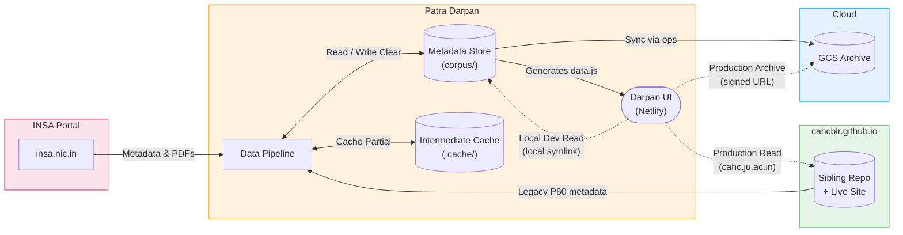
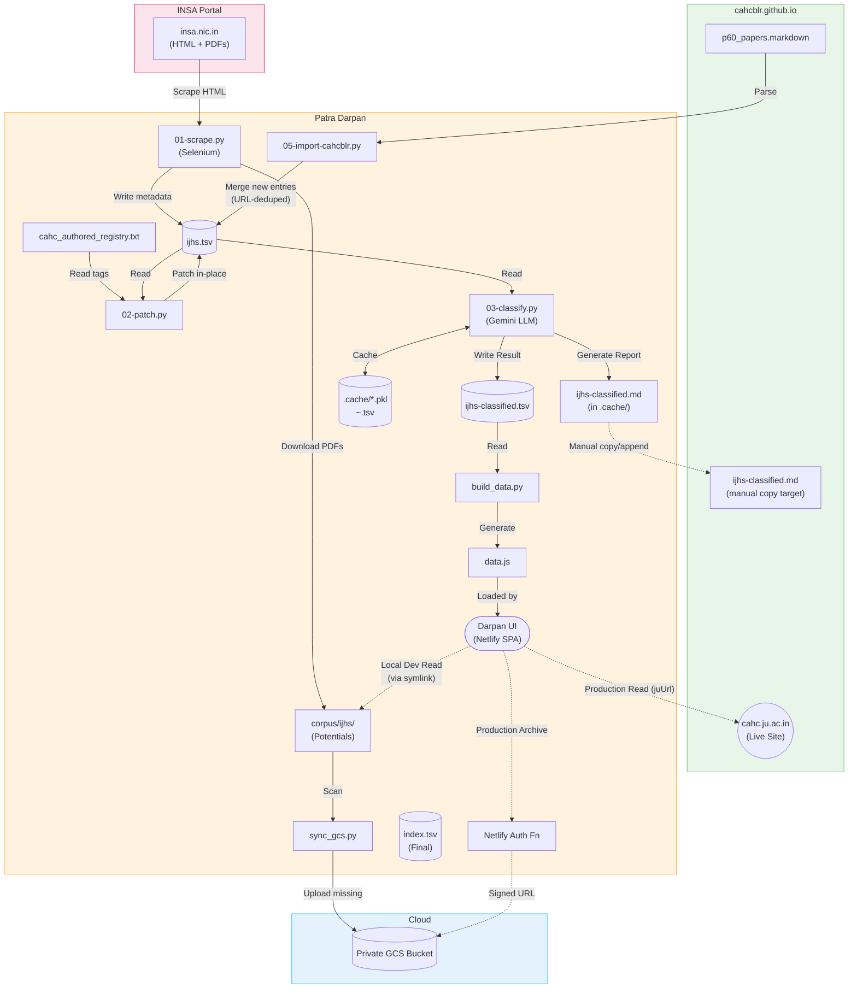
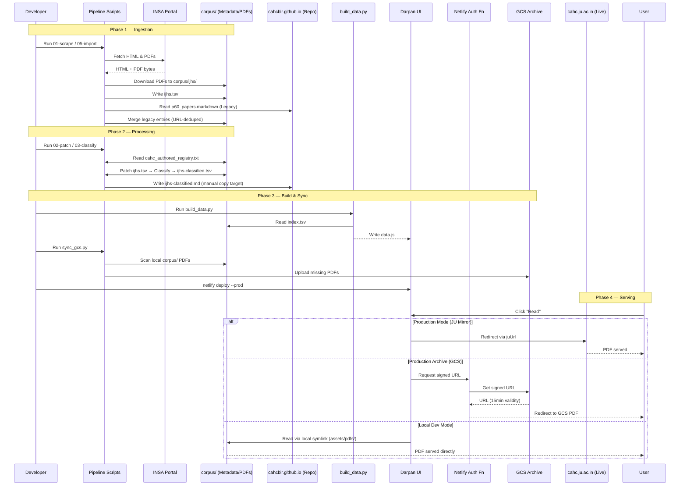

# Patra Darpan

Patra Darpan (Mirror of Documents) is a platform for indexing, classifying, and serving scholarly collections, research papers, and archival documents curated or referenced by the Centre for Ancient History and Culture (CAHC).

## Project Structure

This project has been refactored (Jan 2026) into the following components:

- **`pipeline/`**: Data ingestion and processing scripts.
  - `01-scrape.py`: Scrapes metadata from INSA portal.
  - `02-patch.py`: Fixes metadata errors.
  - `03-classify.py`: Uses Gemini LLM to classify new papers.
  - `04-compare.py`: Compares classification with legacy p85 search.
  - `05-import-cahcblr.py`: Imports non-IJHS metadata from Prof. R.N. Iyengar's collection (`p60`).
  - `bootstrap-ingest.py`: Hardened end-to-end ingestion and deduplication utility.
- **`web/`**: The web application (Netlify).
  - Contains `index.html`, `assets/`, and `netlify/` functions.
- **`corpus/`**: Primary Metadata Store (Tracked in Git).
  - `index.tsv`: The unified master index (Source of Truth for the web app).
  - `ijhs.tsv`: Raw metadata from INSA.
  - `ijhs-classified.tsv`: Machine-classified metadata with subject/category.
- **`.cache/`**: Transient data and intermediate artifacts (Git ignored).
  - Contains `.pkl` caches, `~.tsv` checkpoint files, and `ijhs-classified.md` reports.
- **`ops/`**: Operational utilities.
  - `sync_gcs.py`: Syncs local assets to Google Cloud Storage.
  - `migrate_index.py`: Builds the final index from individual metadata sources.
  - `generate_juni_embeds.py`: Generates the search snippets and sandbox for the JUNI website.

## Setup

Patra Darpan uses `uv` for lightning-fast, reproducible dependency management.

1. Install [uv](https://docs.astral.sh/uv/getting-started/installation/).
2. Run `uv sync` from the project root to build the `.venv`.
3. Commands in this repository use `uv run <script>` to automatically execute within the isolated environment.

## External Dependencies

Patra Darpan is designed as a **Companion Engine** to an external asset repository, but it is architecturally **self-contained** regarding its metadata and internal PDF storage.

1. **Google Cloud Storage (GCS) Credentials**:
   - **Why**: Required by `ops/sync_gcs.py` to mirror the local PDFs to the private GCS bucket for production archiving.
   - **What it does**: Uses your local ADC (Application Default Credentials) via `gcloud`.
2. **Sibling Asset Repository (`cahcblr.github.io`) / Legacy JUNI**:
   - **Why**: Used strictly as an import source for non-IJHS metadata (via `05-import-cahcblr.py`), or as a deployment target for `p85`/`p60` embeds. The `cahc_authored_registry.txt` inside Patra Darpan removes any dependency on this repo for defining core authorship.
3. **Chrome Browser & Selenium**:
   - **Why**: The INSA portal requires JavaScript execution for navigation. `pipeline/01-scrape.py` uses Selenium to automate Chrome for scraping metadata.

## Data Flow Architecture

### 1. High-Level View



### 2. Detailed View

_Each color zone is a zoom-in of the corresponding box in the High-Level View above. Every node maps to a real file or script._



> [!NOTE]
> **On the apparent data cycle between `ijhs-classified.md` and `p85_search.markdown`**: After `03-classify.py` generates `ijhs-classified.md`, it is manually appended to `p85_search.markdown` in the sibling repo. One might expect this to cause `05-import-cahcblr.py` to re-import those same papers on its next run, causing an ever-growing metadata store. This does not happen. The import script checks every candidate URL against the existing `ijhs.tsv` and skips any paper already present. The only data that flows back through `p85` are **JU mirror URLs** (`juUrl`) for papers discovered there — an intentional enrichment step, not a re-import.

### 3. Runtime Sequence



## Usage

### 1. Data Pipeline

The pipeline scripts should be run in sequence to ensure data integrity:

```bash
uv run pipeline/01-scrape.py   # Scrape new metadata
uv run pipeline/05-import-cahcblr.py # Import non-IJHS metadata
uv run pipeline/02-patch.py    # Fix known metadata errors
uv run pipeline/03-classify.py # Classify new papers
```

### 2. Operations

To regenerate the web application data:

```bash
uv run ops/build_data.py
```

To sync PDFs to GCS (uses local ADC/gcloud credentials):

```bash
uv run ops/sync_gcs.py       # Summarize and ask for confirmation
uv run ops/sync_gcs.py -y    # Bypass confirmation (non-interactive)
```

### 3. Diagnostics & Maintenance

Use these tools to maintain the health of the local metadata store:

```bash
uv run ops/analyze_tsv.py   # Find potential duplicates/anomalies
uv run ops/dedupe_tsv.py    # Surgically remove duplicates from corpus
```

### 4. Web Development & Deployment

The Netlify CLI usage differs slightly depending on your objective:

- **Local Development**: Run `dev` from the `web/` directory for a direct local preview.
  ```bash
  cd web
  netlify dev
  ```
- **Local Mode Toggle**: When running `netlify dev`, look for the **Simulation Mode** badge in the header. Click it to toggle between:
  - **Simulation Mode**: Uses INSA for "Read" and GCS (Cloud) for "Archive".
  - **Local Mode**: Uses your local PDF files for "Read" and INSA for "Archive".
- **Production Deployment**: Run `deploy` from the **project root**.
  ```bash
  netlify deploy --prod
  ```

## Content Maintenance Guide

Patra Darpan is a living archive. Follow these workflows to keep the collection current:

### 1. New IJHS Volume Released

When a new volume of the _Indian Journal of History of Science_ is published:

1.  **Scrape**: Run `uv run pipeline/01-scrape.py`. This downloads new PDFs to `corpus/ijhs/` and updates `corpus/ijhs.tsv`.
2.  **Authorship (if applicable)**: If the new volume contains CAHC-authored papers, append the new Paper ID (e.g., `Vol60_1_5.pdf`) to `corpus/cahc_authored_registry.txt`.
3.  **Patch**: Run `uv run pipeline/02-patch.py` to seamlessly apply the registry tags and automated metadata fixes.
4.  **Classify**: Run `uv run pipeline/03-classify.py` to use Gemini for subject/category assignment.
5.  **Merge**: Run `uv run ops/migrate_index.py` to update the master `corpus/index.tsv`.
6.  **Deploy**: Run `uv run ops/build_data.py` followed by `netlify deploy --prod`.

### 2. New CAHC-Authored Paper (PDF)

For papers where you have a local PDF file (AJPEM, ALT, etc.):

1.  **Placement**: Copy the PDF to `corpus/other/`.
2.  **Ingest**: Run `uv run pipeline/bootstrap-ingest.py`. It extracts metadata from the filename and appends a row to `corpus/index.tsv`.
3.  **Cloud Sync**: Run `uv run ops/sync_gcs.py` to upload the new asset to the GCS archive.
4.  **Deploy**: Run `uv run ops/build_data.py` and deploy.

### 3. New External Post/Link

For articles that are only available as external web links (e.g., JSTOR, News):

1.  **Manual Entry**: Manually add a row to `corpus/index.tsv` with the `url` and metadata. Set `source="ext"` and `cahc_authored="true"`.
2.  **Deploy**: Run `uv run ops/build_data.py` and deploy.
