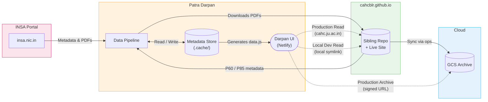
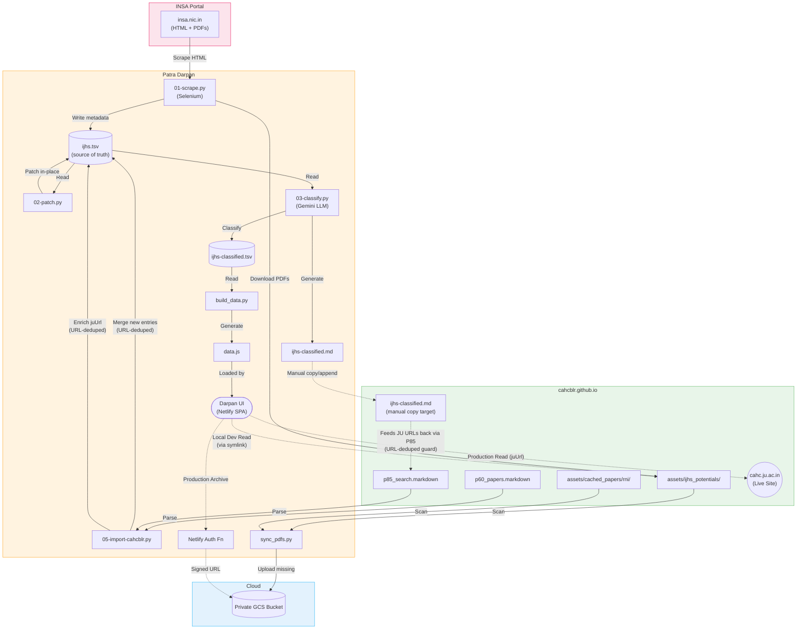
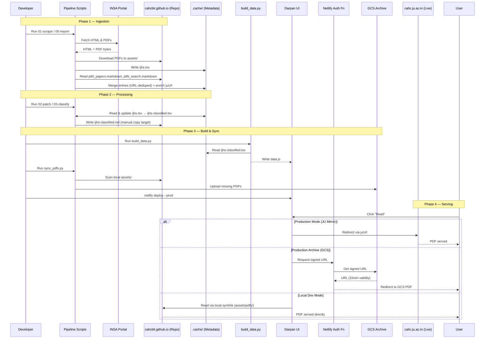

# Patra Darpan

Patra Darpan (Mirror of Documents) is a platform for indexing, classifying, and serving scholarly collections, research papers, and archival documents curated or referenced by the Centre for Ancient History and Culture (CAHC).

## Project Structure

This project has been refactored (Jan 2026) into the following components:

- **`pipeline/`**: Data ingestion and processing scripts.
  - `01-scrape.py`: Scrapes metadata from INSA portal.
  - `02-patch.py`: Fixes metadata errors.
  - `03-classify.py`: Uses Gemini LLM to classify new papers.
  - `04-compare.py`: Compares classification with legacy p85 search.
  - `05-import-cahcblr.py`: Imports non-IJHS metadata from Prof. R.N. Iyengar's collection (`p60`).
- **`web/`**: The web application (Netlify).
  - Contains `index.html`, `assets/`, and `netlify/` functions.
- **`ops/`**: Operational and maintenance utilities.
  - `build_data.py`: Generates `data.js` for the web app.
  - `sync_pdfs.py`: Syncs local PDFs to private GCS bucket.
  - `analyze_tsv.py`: Diagnostic tool to identify duplicates and metadata anomalies.
  - `dedupe_tsv.py`: Surgical utility to clean duplicates from `.cache` files.
- **`.cache/`**: Local data store.
  - Contains `ijhs.tsv` (Source of Truth), `ijhs-classified.tsv`, and intermediate artifacts.

## External Dependencies

Patra Darpan is designed as a **Companion Engine** to an external asset repository. To function fully, it relies on the following external dependencies:

1. **Sibling Asset Repository (`cahcblr.github.io`)**:
   - **Why**: This project does not store PDF files directly to keep the repository lightweight. It relies on a sibling repository located at `~/projects/cahcblr.github.io`.
   - **What it does**: The scraper (`01-scrape.py`) downloads PDFs into `assets/ijhs_potentials` within this sibling repo. The web app uses a symlink to serve these PDFs locally.
2. **Google Cloud Storage (GCS) Credentials**:
   - **Why**: Required by `ops/sync_pdfs.py` to mirror the local PDFs to the private GCS bucket for production serving.
   - **What it does**: Uses your local ADC (Application Default Credentials) via `gcloud`.
3. **Chrome Browser & Selenium**:
   - **Why**: The INSA portal requires JavaScript execution for navigation. `pipeline/01-scrape.py` uses Selenium to automate Chrome for scraping metadata.

## Data Flow Architecture

### 1. High-Level View



### 2. Detailed View

_Each color zone is a zoom-in of the corresponding box in the High-Level View above. Every node maps to a real file or script._



> [!NOTE]
> **On the apparent data cycle between `ijhs-classified.md` and `p85_search.markdown`**: After `03-classify.py` generates `ijhs-classified.md`, it is manually appended to `p85_search.markdown` in the sibling repo. One might expect this to cause `05-import-cahcblr.py` to re-import those same papers on its next run, causing an ever-growing metadata store. This does not happen. The import script checks every candidate URL against the existing `ijhs.tsv` and skips any paper already present. The only data that flows back through `p85` are **JU mirror URLs** (`juUrl`) for papers discovered there — an intentional enrichment step, not a re-import.

### 3. Runtime Sequence



## Usage

### 1. Data Pipeline

The pipeline scripts should be run in sequence to ensure data integrity:

```bash
uv run pipeline/01-scrape.py   # Scrape new metadata
uv run pipeline/05-import-cahcblr.py # Import non-IJHS metadata
uv run pipeline/02-patch.py    # Fix known metadata errors
uv run pipeline/03-classify.py # Classify new papers
```

### 2. Operations

To regenerate the web application data:

```bash
uv run ops/build_data.py
```

To sync PDFs to GCS (uses local ADC/gcloud credentials):

```bash
uv run ops/sync_pdfs.py       # Summarize and ask for confirmation
uv run ops/sync_pdfs.py -y    # Bypass confirmation (non-interactive)
```

### 3. Diagnostics & Maintenance

Use these tools to maintain the health of the local metadata store:

```bash
uv run ops/analyze_tsv.py   # Find potential duplicates/anomalies
uv run ops/dedupe_tsv.py    # Surgically remove duplicates from .cache
```

### 4. Web Development & Deployment

The Netlify CLI usage differs slightly depending on your objective:

- **Local Development**: Run `dev` from the `web/` directory for a direct local preview.
  ```bash
  cd web
  netlify dev
  ```
- **Local Mode Toggle**: When running `netlify dev`, look for the **Simulation Mode** badge in the header. Click it to toggle between:
  - **Simulation Mode**: Uses INSA for "Read" and GCS (Cloud) for "Archive".
  - **Local Mode**: Uses your local PDF files for "Read" and INSA for "Archive".
- **Production Deployment**: Run `deploy` from the **project root**.
  ```bash
  netlify deploy --prod
  ```

> [!NOTE]
> The root `netlify.toml` serves as the primary configuration for the entire pipeline, while the `web/` directory is treated as a specialized context for local serving.
