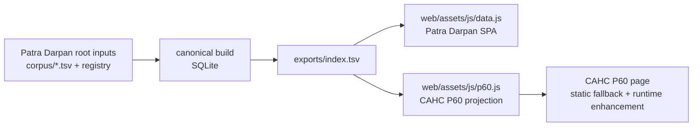

# CAHC P60 Projection PRD

## Purpose

Patra Darpan should become the single place where CAHC paper and article
metadata is added. CAHC pages should reflect that metadata with minimal manual
editing and without maintaining duplicate table rows by hand.

The immediate target is the CAHC `P60` papers page. The larger `P85` search
page should stop carrying a manually maintained 2000-row table and should point
readers to Patra Darpan instead.

## Problem

The current CAHC `P60` and `P85` pages duplicate Patra Darpan corpus metadata.
This creates several recurring problems:

- new CAHC-authored papers and links must be added in more than one place
- row numbering and table ordering must be manually maintained in Markdown
- `P85` is large enough that hand edits are brittle and agent edits are
  unpleasant
- the durable CAHC mirror collection under `assets/cached_papers/rni/` is not
  represented as a first-class downstream projection
- iframe-based attempts are brittle because they depend on framing headers,
  sizing, and Patra Darpan runtime availability

## Goals

- Treat Patra Darpan root inputs as the authority for new paper and link
  additions.
- Project `cahc_authored=true` rows into a CAHC `P60` consumable artifact.
- Preserve CAHC's static fallback table so the page remains useful if Patra
  Darpan is unavailable.
- Prefer CAHC-local mirror links for `P60` PDF rows when available.
- Avoid future manual resequencing of `P60` row numbers.
- Remove the need to maintain the large `P85` inline table by hand.
- Keep the workflow simple enough for one maintainer to operate predictably.

## Non-Goals

- Do not replace Patra Darpan's broader IJHS/GCS access model.
- Do not make GCS the primary access path for CAHC `P60` papers.
- Do not require CAHC rebuilds for every new CAHC-authored document once the
  runtime projection is wired.
- Do not make iframe embedding the primary integration path in this phase.
- Do not introduce a full API service; this is a static projection problem.

## Source Of Truth

The `P60` source set is:

- rows in `exports/index.tsv`
- where `cahc_authored` is `true`
- after the normal Patra Darpan canonical build and export have run

The unlinked historical CAHC `P60` row:

- `Some earthquakes of the Himalayan region from historical sources`

does not count for parity with Patra Darpan unless it later becomes a real
curated link or PDF-backed row in Patra Darpan.

## Logical Flow



`p60.js` is a generated projection artifact. It is not a source of truth.

## Projection Contract

Patra Darpan should publish a small generated browser-consumable projection for
`P60`, tentatively:

- `web/assets/js/p60.js`

The projected records should include:

- `year`
- `category`, populated from Patra Darpan `subject` for the CAHC table display
- `title`
- `author`
- `source`
- `url`
- `entry_type`

The projection should not persist row numbers. The CAHC renderer should number
rows at render time after sorting.

The default sort should match the current `P60` reader expectation:

- newest year first
- stable secondary ordering from the Patra Darpan export where possible

## URL Policy

For PDF rows, `P60` should prefer CAHC mirror URLs because the CAHC mirror is
the durable no-cost core-publication surface.

Preferred URL order for `P60`:

1. CAHC mirror URL under `https://cahc.jainuniversity.ac.in/assets/cached_papers/rni/`
2. external URL for URL-only rows, such as Swarajya articles
3. source URL only when there is no CAHC mirror URL

For CAHC page rendering, absolute CAHC mirror URLs may be converted to local
site paths:

- `/assets/cached_papers/rni/<filename>`

GCS remains useful for Patra Darpan archive resilience, especially for the
broader IJHS corpus, but it should not be the primary `P60` link target.

## Runtime Integration

CAHC should keep the current static table as fallback and progressively enhance
it when the Patra Darpan projection loads.

Proposed behavior:

- CAHC page renders the existing static table by default.
- Browser loads Patra Darpan's `p60.js`.
- If `p60.js` loads and validates, the page replaces the table rows with the
  projected rows.
- If the script fails, is blocked, or has invalid data, the fallback table
  remains visible.

This keeps CAHC usable when Patra Darpan is unavailable while eliminating normal
future hand edits for new additions.

## Why `p60.js`

`p60.js` is favored over `p60.json` for the first implementation because it can
be loaded through a normal `<script>` tag from a static GitHub Pages page
without needing CORS configuration.

Expected shape:

```js
window.PATRA_DARPAN_P60 = {
  generatedAt: "...",
  rows: [...]
};
window.dispatchEvent(new CustomEvent("patra-darpan:p60-ready"));
```

`p60.json` remains a reasonable later option if a cleaner data-only contract is
worth adding CORS headers for.

## Cache Header

The `p60.js` cache behavior should be configured as deployment/static-hosting
metadata, not handwritten application logic.

For Netlify, that likely means a `web/netlify.toml` header rule for only the
projection file, for example:

```toml
[[headers]]
  for = "/assets/js/p60.js"
  [headers.values]
    Cache-Control = "public, max-age=300, stale-while-revalidate=3600"
```

This lets browsers reuse the projection briefly, then cheaply revalidate. If
the file is unchanged, the server can return `304 Not Modified` rather than
redownloading the whole file.

Decision:

- Use a short cache window for the first implementation because the projection
  is small and the user-facing value of showing newly added papers promptly is
  higher than saving a tiny request.
- `max-age=300` with `stale-while-revalidate=3600` is an acceptable starting
  point even if the file is normally rebuilt weekly.
- If the center's publication activity increases or the file grows
  substantially, revisit the cache duration and consider versioned filenames.

## Local Development

The CAHC page should support a local Patra Darpan projection during testing.

Production default:

- load `https://patra-darpan.netlify.app/assets/js/p60.js`

Local override:

- allow a query parameter such as `pd_base=http://127.0.0.1:8000`
- load `http://127.0.0.1:8000/assets/js/p60.js`

This lets `jekyll serve` test against a local Patra Darpan branch without
editing CAHC Markdown for each test.

Patra Darpan should also include a small local-only sandbox page, tentatively:

- `web/p60-projection-sandbox.html`

The sandbox should:

- load `assets/js/p60.js`
- render the projected rows into a simple table
- show a local status/count for maintainers
- keep generated timestamps out of the rendered user-facing table
- let maintainers validate sorting, link targets, and payload shape before
  changing the CAHC repository

## P85 Decision

`P85` should not continue to carry a manually maintained 2000-row inline table.

Preferred phase-1 behavior:

- keep or improve the Patra Darpan button/link as the main academic-paper
  search entry point
- remove the large inline Markdown table after the replacement path is agreed
- defer iframe embedding unless there is a specific reason to provide an
  in-page Patra Darpan view

If iframe embedding is revisited, Patra Darpan framing headers must be changed
deliberately. The current Netlify config includes `X-Frame-Options = "DENY"`,
which blocks iframe embedding.

## Operational Caveat

For a new CAHC-authored PDF to work well in `P60`, metadata alone is not enough.
The PDF must also land in the durable CAHC mirror path if the `P60` link is
expected to use the no-cost CAHC mirror:

- `assets/cached_papers/rni/<filename>` in the CAHC GitHub Pages repository

This creates a real two-part operation for new CAHC-authored PDFs:

1. Add the metadata and authorship marker in Patra Darpan.
2. Ensure the mirrored PDF exists in CAHC `assets/cached_papers/rni/`.

Decision:

- Patra Darpan should provide an advisory audit that checks whether each
  `cahc_authored=true` PDF has a reachable CAHC mirror URL and, where possible
  locally, a matching file in the CAHC checkout.
- This audit should warn rather than block the normal projection build.

## Proposed Implementation Phases

### Phase 1: Projection Contract

- document the `p60.js` shape
- generate the `p60.js` projection from `exports/index.tsv`
- include only `cahc_authored=true` rows
- prefer CAHC mirror URLs for PDFs
- add a focused cache header for `p60.js`

### Phase 2: CAHC Progressive Enhancement

- leave the static `P60` table in place as fallback
- add a small loader to CAHC `P60`
- render projected rows into the same table shape
- preserve existing table styling and search behavior
- support a local Patra Darpan base URL override for development

### Phase 3: P85 Cleanup

- remove the large inline `P85` table
- keep Patra Darpan as the primary paper-search entry point
- decide separately whether an iframe/search embed is worth adding later

## Resolved Decisions

- `cahc_authored=true` is the `P60` inclusion flag for this branch. Do not add a
  separate `p60_collection` flag now.
- The CAHC mirror-file audit should be advisory, not blocking.
- Generated timestamps belong only in the JavaScript payload for debugging.
  They should not be shown to readers.
- `p60.js` should use a short production cache window initially. The current
  expected rebuild cadence is weekly, or daily if center activity increases, so
  freshness is easy to preserve without creating meaningful bandwidth cost.
