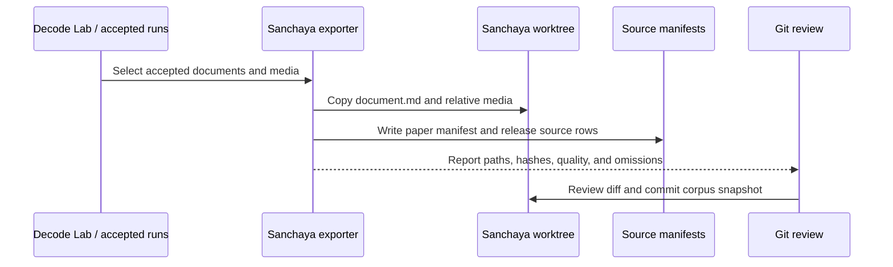
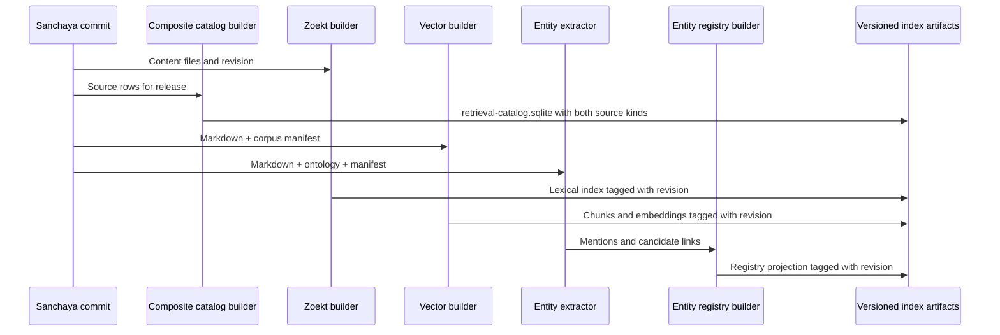
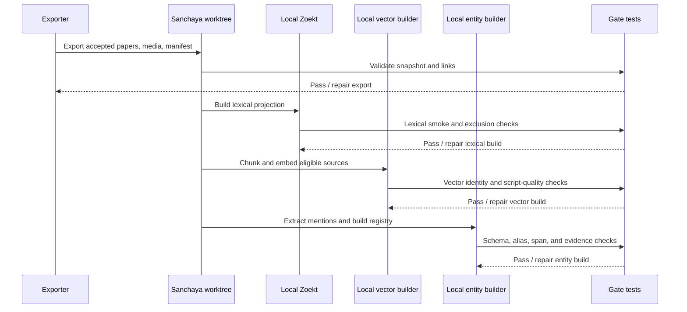
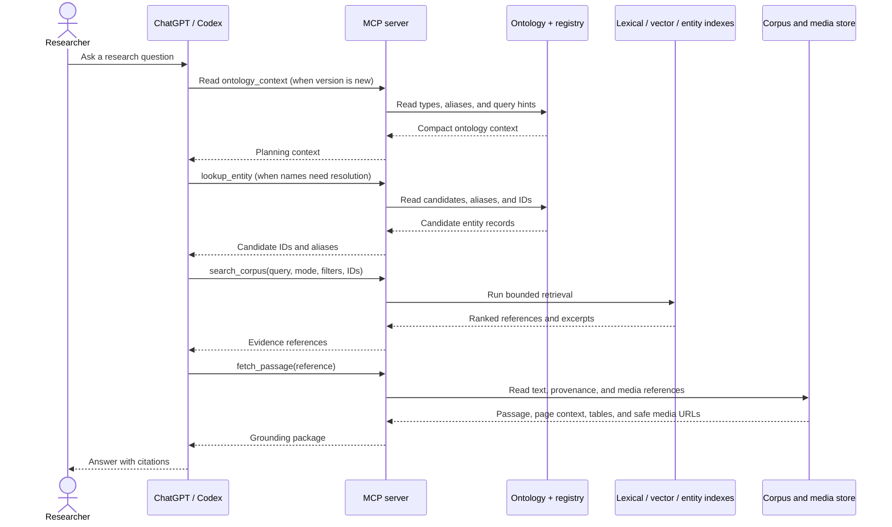
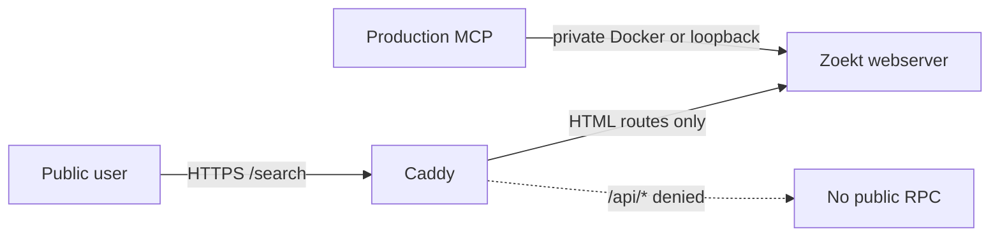
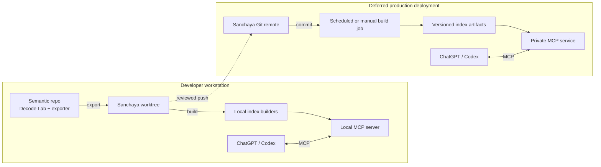

# ISCLS Architecture

## Design stance

ISCLS is a corpus snapshot with three rebuildable projections and a composite
release catalog. The canonical content is versioned in Sanchaya. Patra Darpan
SQLite remains authoritative for `pd:*` paper metadata, while the Sanchaya
manifest describes `sanchaya:*` text documents. The lexical, vector, and
entity indexes are derived artifacts.

The architecture keeps logical roles stable while leaving physical stores
replaceable. In particular, the pilot does not commit to a particular vector
database or entity-registry database.

### Principles

1. **One content snapshot.** Zoekt, vector, and entity builds consume the same
   Sanchaya commit.
2. **Metadata is separate.** Machine metadata is in the release catalog and
   source manifests, not Markdown front matter.
3. **Identity is stable.** Paths and categories can change; document and chunk
   IDs should not.
4. **Projections are disposable.** Indexes can be rebuilt from the corpus and
   recorded build inputs.
5. **Read-only online boundary.** Corpus, ontology, and index writes happen
   offline or in reviewed build jobs.
6. **Focused diagrams.** Each diagram explains one process or boundary. The
   diagrams intentionally do not attempt to show every connection at once.

## Logical layers

```text
Source PDFs and existing Sanchaya text
        │
        ▼
Decoded Markdown + media + source provenance
        │
        ▼
Sanchaya corpus commit
        │
        ├── Zoekt lexical projection
        ├── vector projection
        └── entity mentions → entity registry projection
```

### Source and export layer

The Patra Darpan semantic repository owns decoding, review, repair, and export.
The exporter writes a controlled projection into the Sanchaya checkout at
`~/projects/sanchaya` (configurable through `SANCHAYA_REPO_ROOT`). It copies
accepted `document.md` files and their relative media directories, then writes
portable manifest rows.

The exporter does not copy local run directories, absolute local paths, or raw
PDFs by default. Source PDF URLs, hashes, page mappings, and extraction run
identifiers belong in metadata.

### Repository and runtime boundaries

The Patra Darpan repository is the single code home for the web GUI, exporter,
retrieval builders, and MCP service. The current `feat/pdf-semantic-index` branch
is a temporary pre-merge deployment source; after review, production uses the
corresponding `main` commit or tag.

The `sanchaya-zoekt` repository remains an independent lexical service. Its
Zoekt containers own repository synchronization, lexical shards, web routes,
and RPC. Retrieval runs as separate containers (builder, Qdrant, and MCP),
optionally added through a Compose overlay/profile. The semantic builder reads
the synchronized Sanchaya checkout read-only and never maintains a second
corpus clone.

Development mounts the existing local Sanchaya checkout. Production mounts the
Zoekt-managed checkout. Both environments keep generated chunks, entity
projections, and vector data outside the Git worktrees.

A release record binds the Patra Darpan commit, Sanchaya commit, ontology,
chunker, embedding model, and artifact/index identifiers. The semantic builder
is run explicitly after a corpus or pipeline change; starting the web, Zoekt,
or MCP services does not trigger a full embedding build.

### Canonical corpus and artifact layout

This is the pilot layout. The Sanchaya checkout contains corpus content and
export manifests; the Patra Darpan checkout owns the canonical paper catalog,
ontology, and build code. Generated retrieval artifacts stay outside both Git
worktrees.

```text
patra-darpan-pdf-semantic-index/
  ontology/
    jyotisha-v0.3.json                # human-maintained active snapshot
  docs/iscls/                         # durable pilot contracts
  reports/iscls/                      # one-off generation/evaluation records

sanchaya/
  <existing Indic text directories>/
  patra-darpan/
    papers/
      <safe-doc-id>/
        document.md
        media/
          p04_page.png
          ...
    catalog/
      corpus-manifest.jsonl          # export/audit projection for papers

.local/retrieval/
  chunks.jsonl
  entity-mentions.jsonl              # derived from chunks + ontology
  entity-registry.jsonl              # rebuildable lookup projection
  releases/<release-id>/              # immutable MCP input
    retrieval-catalog.sqlite          # pd:* + sanchaya:* metadata snapshot
```

`document.md` remains clean Markdown. Relative image links are preserved. A
Markdown table remains text and is therefore available to lexical and vector
processing. An image-only table needs OCR or vision extraction before it can be
searched as text.

### Corpus manifest and release catalog

`corpus-manifest.jsonl` is the normalized export and audit projection written
by export/normalization. It is not the universal runtime catalog: it primarily
describes exported Patra Darpan papers and may not contain every Sanchaya text.

Each retrieval release materializes `retrieval-catalog.sqlite` from the
canonical Patra Darpan SQLite database plus the release's Sanchaya source
manifest. The Patra Darpan side is bibliographically complete; the
`indexed_in_release` field marks whether a document also has content in the
current release. Sanchaya rows remain release-scoped. See
[catalog.md](catalog.md) for the schema and query contract.

A row should carry at least:

```json
{
  "document_id": "pd:Vol43_1_1_RNIyengar",
  "source_kind": "patra-darpan",
  "repo_path": "patra-darpan/papers/Vol43_1_1_RNIyengar/document.md",
  "title": "...",
  "authors": ["..."],
  "year": 2024,
  "primary_category": "jyotisha",
  "categories": ["jyotisha", "astronomy"],
  "content_sha256": "...",
  "source_refs": [
    {"kind": "insa-ijhs", "role": "primary_pdf", "uri": "https://..."},
    {"kind": "cahc", "role": "mirror_pdf", "uri": "https://..."},
    {"kind": "gcs", "role": "managed_asset", "uri": "gs://..."}
  ],
  "media_prefix": "patra-darpan/papers/Vol43_1_1_RNIyengar/media/",
  "quality_status": "ok",
  "extractor_version": "..."
}
```

The decoder's raw manifest remains an extraction ledger. The Sanchaya corpus
manifest is a normalized export projection; it must not contain absolute local
paths.

### Source references

The manifest may carry more than one source reference for a document. Use a
typed `source_refs` array rather than a single overloaded URL field. This keeps
the INSA/IJHS source, a CAHC mirror, and the managed GCS asset related without
pretending that they have the same authority or lifecycle.

```json
"source_refs": [
  {
    "kind": "insa-ijhs",
    "role": "primary_pdf",
    "uri": "https://insa.nic.in/.../paper.pdf"
  },
  {
    "kind": "cahc",
    "role": "mirror_pdf",
    "uri": "https://cahc.jainuniversity.ac.in/.../paper.pdf"
  },
  {
    "kind": "gcs",
    "role": "managed_asset",
    "uri": "gs://cahcblr-pdfs/assets/ijhs/paper.pdf",
    "https_uri": "https://storage.googleapis.com/cahcblr-pdfs/assets/ijhs/paper.pdf"
  }
]
```

`uri` is the canonical reference and `https_uri` is optional convenience data.
Signed URLs, access tokens, local filesystem paths, and temporary download URLs
do not belong in the committed manifest. Each reference may also carry an
observed-at timestamp, HTTP metadata, and a content hash when available. The
manifest records provenance; it does not promise that every reference remains
reachable.

### Entity artifacts

`entity-mentions.jsonl` is a derived observation stream with one row per
mention. An extraction window is represented inside the row, so one paragraph
with three mentions produces three rows. This makes mention counts,
pagination, and canonical-link changes deterministic without rerunning PDF
decoding.

The pilot contract is:

```json
{
  "schema_version": "retrieval.entity-mention.v1",
  "mention_id": "em:8d7...",
  "corpus_revision": "<sanchaya-commit-sha>",
  "document_id": "pd:Vol43_1_1_RNIyengar",
  "window": {
    "id": "p04-paragraph-003",
    "kind": "paragraph",
    "page": 4,
    "section_path": ["Results"],
    "text_sha256": "..."
  },
  "span": {
    "start": 18,
    "end": 23,
    "unit": "unicode_codepoint",
    "basis": "window_text"
  },
  "surface_form": "सूर्य",
  "normalized_form": "surya",
  "entity_type": "celestial_body",
  "canonical_entity_id": "jyotisha:sun",
  "candidate_entity_ids": [],
  "resolution_status": "resolved",
  "confidence": 0.98,
  "extractor": {
    "name": "starter-gazetteer",
    "version": "0.1.0",
    "method": "gazetteer"
  },
  "ontology_version": "jyotisha-0.3.0",
  "related_chunk_ids": ["chunk:..." ]
}
```

`canonical_entity_id` is nullable. `resolution_status` is one of `resolved`,
`candidate`, or `unresolved`. Offsets are Unicode code-point offsets into the
identified window, not byte offsets; the surface form and window hash make the
span auditable. Topics such as `astronomy` are separate classification labels,
not forced into `entity_type`. Relations are a later projection, not hidden in
the mention row. The registry builder may change a canonical link without
changing the observed surface span.

The **entity registry** is a logical query projection containing canonical IDs,
labels, aliases, and links to mentions and documents. For the pilot it may be a
JSONL projection, SQLite table, or service-local index. The MCP contract should
not depend on the physical representation.

### Ontology

The ontology is a human-maintained input, not an extraction result. The pilot
needs a small versioned type/relation vocabulary and seed aliases. An empty
ontology *schema* is valid as a file-format test, but it is not a useful
starter: it cannot resolve aliases or provide meaningful type hints. The pilot
therefore starts with the repository-owned, non-empty snapshot
[`jyotisha-v0.3.json`](../../ontology/jyotisha-v0.3.json). Earlier snapshots
remain available in [`ontology/`](../../ontology/) for history and comparison.

Entity extraction may still produce unresolved mentions when the vocabulary
does not contain a confident match. An empty **registry** is different and is
expected before the first extraction run.

The ontology and seed records are read by extraction, resolution, and MCP
lookup. Online tools do not edit them.

## Identity and revision

### Document IDs

- Existing Sanchaya text uses a namespaced ID derived from its normalized
  repository-relative identity, for example `sc:jyotisham/foo.txt`.
- Patra Darpan uses a namespaced stable source ID, for example
  `pd:Vol43_1_1_RNIyengar`.
- A category or directory change must not silently change a document ID.

### Chunk IDs

A chunk ID joins the vector, evidence, and entity projections. It should be
stable for unchanged content and include the chunker version in its derivation,
for example:

```text
chunk_id = hash(document_id + logical_location + chunker_version + text_hash)
```

The exact encoding is implementation detail; the join semantics are not.

### Corpus revision

Every derived index records the Sanchaya commit SHA that supplied its input.
Each build also records its source eligibility policy (especially for vector
and entity coverage), model/extractor versions, counts, and build status. The
MCP server reports or verifies the corpus revision when combining projections;
it does not silently combine an all-corpus lexical build with a stale partial
vector build.

## Offline export process

This sequence shows the document export boundary without mixing in online
query behavior.



The exporter is deterministic and idempotent. It can export 120 documents now
and add later documents without changing the contract.

## Independent index builds

The three projections are built from the committed corpus. They do not call one
another to discover content.



### Zoekt projection

Zoekt indexes Sanchaya text and exported paper Markdown. Catalog metadata is
not a user-facing lexical corpus. The index build or search gateway must exclude
catalog paths; the MCP wrapper additionally enforces an allowlist for content
paths.

The raw Zoekt RPC remains private to the retrieval service. Users reach it
through `search_corpus`, which constrains repository, path, result count, and
context size.

### Vector projection

The vector builder:

1. reads the release source rows and Markdown;
2. applies deterministic, structure-aware chunking;
3. writes chunk text and provenance to a logical chunk store;
4. embeds each chunk using the chosen model; and
5. stores vectors keyed by `chunk_id` and corpus revision.

The query path embeds the user query at search time. Metadata remains filterable
without being injected into the Markdown or necessarily embedded into the text.

#### Coverage policy for Indic Sanchaya text

The logical vector projection covers both source kinds; it is not a
paper-only architecture. The pilot should avoid embedding every Sanchaya file
before we know that the chosen model handles Sanskrit well enough. Use staged
coverage:

| Build profile | Vector corpus | Why |
| --- | --- | --- |
| Pilot | 120 Patra Darpan papers plus all `Jyotisham` text and fixed demo anchors | Tests paper prose, tables, and the Devanagari/IAST cases that the demo will ask about |
| Expansion | 200 papers plus the same `Jyotisham` scope | Measures repeatability and model quality with a larger evidence pool |
| Full | All eligible Sanchaya text plus the Patra Darpan corpus | Maximizes conceptual coverage after the model and chunking policy pass evaluation |

Zoekt may cover the full Sanchaya corpus from the beginning. Vector coverage
is an eligibility policy recorded in the build manifest, not a different
identity scheme. A single logical vector adapter can expose source filters and
can later be backed by shards without changing MCP calls.

Indic quality needs an explicit bake-off. Evaluate at least Devanagari,
IAST, and mixed-script questions against the same passages. Prefer an
embedding model with demonstrated Sanskrit/Indic and multilingual support;
English-only semantic quality is not evidence for this corpus. Preserve the
original script in chunks and use the ontology's explicit aliases for query
expansion. Do not silently translate or replace the source text.

The sizing model is straightforward even before exact corpus inventory:

```text
chunk_count       ≈ eligible_tokens / target_chunk_tokens
embedding_work    ∝ chunk_count × average_chunk_tokens
raw_vector_bytes  ≈ chunk_count × dimensions × bytes_per_number
```

Index build time and cost are driven by tokens and embedding throughput, not by
the number of papers alone. Lookup latency is driven primarily by vector count,
index structure, filters, and top-k, while index size is vector bytes plus
metadata and ANN overhead. Measure these for the pilot slice, then project the
full corpus from observed tokens/chunk and build throughput. This avoids making
an unsupported promise about the 4k-file corpus before its token inventory is
known.

### Entity projection

Entity extraction uses paragraph, verse, table, or section windows when those
provide better context than vector chunks. Each result maps back to document
and, where possible, nearby chunk IDs. Resolution may link a mention to a
canonical entity or leave it unresolved.

The entity registry is built after extraction and can be regenerated without
re-running PDF decoding or vector embedding.

## Local validation order

The local path is intentionally sequential. Each projection is tested directly
before the next one is introduced; none of the index builders calls another
builder to discover content.



## Online query path

ChatGPT or Codex owns conversation, planning, and answer synthesis. MCP owns
bounded retrieval calls. The retrieval services own indexes and provenance.



The host may skip lookup or fetch when unnecessary, but the final answer should
be grounded in fetched evidence for research claims.

## MCP boundary

All pilot tools are read-only, stateless, and bounded.

### Index access model

The MCP server talks to backend adapters; it does not open arbitrary index
files on behalf of the chat host.

- **Zoekt:** the local implementation uses the Docker service over its
  configured HTTP/RPC endpoint. A later production deployment can use the
  private or authenticated Sanchaya Zoekt endpoint (for example,
  `sanchaya.rasowshi.us`) through configuration. The MCP contract does not
  depend on whether the endpoint is local or remote.
- **Vector index:** the adapter uses the selected local library/database in
  development, and a service or database client in production if needed. It
  receives a query vector and returns chunk references; the embedding model is
  an explicit build/runtime dependency.
- **Entity projection:** JSONL is a portable build artifact, not the ideal
  query path at scale. The pilot may load it into memory or a small local
  database; a larger deployment should use a keyed registry/mention store or
  service behind the same adapter.

Thus lexical and entity retrieval are separate backend calls behind one MCP
server. They need not share a process or programming language. They must share
document IDs, corpus revision, and evidence locators.

### Catalog access

The catalog adapter reads the immutable `retrieval-catalog.sqlite` artifact.
`pd:*` rows retain Patra Darpan SQLite as their authority; `sanchaya:*` rows
retain the Sanchaya source manifest as their authority. The composite file is a
release snapshot, not a new upstream source of truth.

Metadata-first MCP operations are bounded and deterministic:

- `get_document_metadata`
- `get_documents_metadata`
- `search_documents`
- `get_author_works`
- `get_corpus_info`

Retrieval operations are also bounded and reference-preserving:

- `lookup_entity`
- `list_entity_mentions`
- `search_corpus`
- `fetch_passage`
- `fetch_passages`

The catalog reports source counts and entity-index coverage separately, so a
partial entity build cannot be mistaken for full-corpus absence.
Document responses also report `indexed_in_release`; metadata lookup defaults
to the complete Patra Darpan catalog, while content retrieval should use rows
where that flag is true.

The current local implementation is deliberately thin at this boundary:
[`lib/retrieval_adapters.py`](../../lib/retrieval_adapters.py) contains the
catalog, Zoekt, Qdrant, JSONL, passage, and fusion adapters;
[`scripts/create_retrieval_release.py`](../../scripts/create_retrieval_release.py)
materializes one immutable release; and
[`scripts/retrieval_mcp_server.py`](../../scripts/retrieval_mcp_server.py)
registers the retrieval and metadata tools plus two read-only resources. The adapter layer is the
stable seam for later replacing JSONL with a keyed store or Qdrant with another
vector service.

### Zoekt RPC deployment boundary

Zoekt's `-rpc` flag enables its JSON search API (`POST /api/search` and
`POST /api/list`) on the same listener as the HTML interface. It is a backend
capability, not the public application boundary and not an MCP server.

Development is local-first:

- the local MCP server calls the local Zoekt Docker service through its local
  HTTP endpoint;
- the local profile may enable `-rpc` while preserving the HTML routes; and
- the local gate tests both the HTML page and a bounded JSON search request.

Production has a stricter network boundary:

- MCP and Zoekt run on `sanchaya.rasowshi.us` on the same host, preferably as
  services on the same private Docker network;
- Zoekt's `-rpc` listener is not published as a host or public port;
- MCP calls `http://zoekt-webserver:6070/api/search` (or a loopback-only port
  when MCP is a host process), never the public website URL;
- public Caddy continues to proxy the HTML search experience; and
- Caddy rejects `/api` and `/api/*` before its public catch-all proxy.

The production Caddy boundary is expressed as a route before the final public
`handle`:

```caddyfile
@zoekt_rpc path /api /api/*
handle @zoekt_rpc {
    respond "Not found" 404
}
```

If a future deployment needs an MCP client outside the host, replace the deny
route with an authenticated, IP-restricted route and add rate limiting at the
gateway. `-rpc` itself provides neither authentication nor rate limiting.

The public MCP route follows the same boundary but terminates TLS at Caddy.
For the trusted pilot, the MCP service validates the shared bearer token from
the host-only environment file:

```caddyfile
@mcp path /mcp /mcp/*
handle @mcp {
    reverse_proxy retrieval-mcp:8787
}
```

The retrieval companion's production Compose overlay attaches `retrieval-mcp`
to the existing private Zoekt network and removes host port publication. The
external URL is therefore HTTPS at the Caddy hostname while the container hop
remains HTTP. See [https.md](https.md) for the local `tls internal` profile and
the production invocation.



### `lookup_entity`

Reads the ontology and registry. Returns candidate IDs, labels, aliases, types,
confidence, and links to evidence. It does not create or edit entities.

### `search_corpus`

Accepts a query, mode (`lexical`, `vector`, or `hybrid`), optional category or
source filters, optional entity IDs, and a result limit. Returns ranked
references, excerpts, scores, and revision metadata.

### `fetch_passage`

Accepts a document/chunk reference and context options. Returns text, logical
location, page provenance, content hash, and safe media references. It rejects
catalog paths and arbitrary filesystem paths.

### `fetch_passages`

Accepts up to 50 references in one call and returns one bounded result per
reference. A stale reference is reported beside successful results rather than
failing the whole batch. This is the preferred follow-up for a search response
containing several evidence references.

### `list_entity_mentions`

Accepts a canonical entity ID or document filter and returns paginated mentions,
source spans, and evidence references. It reads the registry/mention projection
but does not change it.

### Ontology context resource

The MCP server exposes a compact read-only `ontology_context` resource
(or an equivalent `get_ontology_context` tool for clients without resource
support). It contains the ontology ID/version, entity types, relation names,
topic labels, normalization rules, and a few seed examples. It is planning
context for ChatGPT/Codex, not a dump of every mention or registry row.

The host can read this resource once per session or when the version changes,
then use `lookup_entity` for actual candidate resolution. This gives the model
enough vocabulary to form useful calls without making the ontology a mutable
chat state or consuming the context window with the full registry.

## Development and production topology

Development consumes a reviewed local Sanchaya worktree, builds each projection
locally, and connects a local MCP server to local backend adapters. Production
uses the same service boundaries with different mounts, credentials, and
resource settings after the pilot gates pass.



The raw Zoekt endpoint and index files are not the public application boundary.
The MCP service is the policy boundary for paths, limits, and tool behavior.

## Failure and repair behavior

- A failed document export leaves its previous accepted projection untouched and
  reports the document in an export audit.
- A vector or entity build can retry documents whose content hash or build
  inputs changed.
- A one-off extraction repair produces a new document content hash and requires
  the affected projections to be rebuilt.
- An index built from a different corpus revision must not be silently fused
  with current results.

## Scale considerations

The logical design supports 2,000 papers. Before full-corpus operation, the
implementation should add:

- content-hash based incremental exports and builds;
- resumable embedding and entity batches;
- durable artifact retention by corpus revision;
- disk monitoring for Zoekt and temporary build space;
- an asset strategy for large media collections; and
- query limits, pagination, and request timeouts.

These are operational hardening steps, not a redesign of the data flow.
