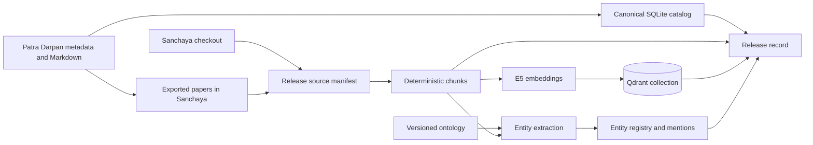
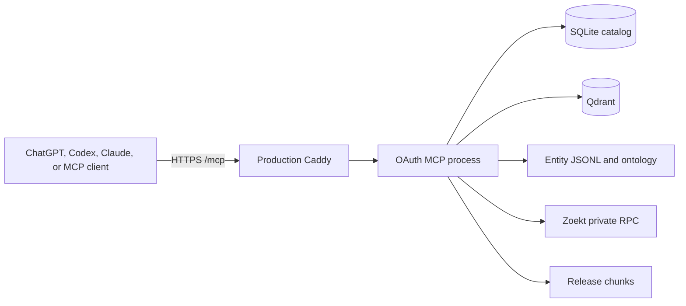

# Retrieval architecture

## Design stance

The retrieval system produces several projections from one reviewed corpus
snapshot. Each projection can be rebuilt independently, but all of them use
stable document and chunk identities and are activated as one release.

The chat host plans tool calls and synthesizes answers. MCP applies bounded
retrieval policy. Backend adapters access the catalog, lexical service, vector
store, entity artifacts, and passage store.

## Ownership

| Concern | Owner |
| --- | --- |
| Paper metadata, decoded Markdown, exporter, catalog, chunks | Patra Darpan |
| Ontology, entity registry, entity mentions | Patra Darpan retrieval |
| Embeddings and Qdrant collection | Patra Darpan retrieval |
| MCP tools, resources, OAuth process, allowlist | Patra Darpan retrieval |
| Sanchaya checkout, Zoekt shards, lexical RPC, public search UI | Sanchaya-Zoekt |
| Public TLS and route dispatch on the production host | Sanchaya-Zoekt Caddy |

The Sanchaya content checkout is mounted read-only into the retrieval builder.
The retrieval system does not modify it. MCP does not read Zoekt shard files;
it calls the private Zoekt RPC adapter.

## Offline build

The builder performs these logical steps:

1. Refresh the canonical SQLite metadata catalog.
2. Select paper and Sanchaya sources using environment-controlled scopes.
3. Create deterministic document and chunk records.
4. Build entity registry and mention artifacts from the active ontology.
5. Embed the selected chunks and upsert them to a release-specific Qdrant
   collection.
6. Write and atomically activate a release record only after every required
   artifact is present.

Zoekt has its own index lifecycle in the Sanchaya-Zoekt project. The release
records the Sanchaya revision that the other projections were built from so
operators can detect drift.

## Online query path

The OAuth and bearer processes use the same MCP application code and backend
adapters. Authentication changes the edge and request identity; it does not
change tool behavior.

Metadata questions should use the SQLite-backed metadata tools. Content
questions use lexical, vector, or hybrid retrieval and then fetch bounded
passages. Entity-aware questions first resolve aliases to canonical IDs and
then search or browse mentions.

## Storage and process boundaries

| Data or service | Runtime access |
| --- | --- |
| `spasta-corpus.sqlite` | Long-lived read-only catalog connection |
| Active release directory | Read-only chunks, manifests, entity JSONL, release metadata |
| Qdrant | HTTP API on the private retrieval network |
| Zoekt | RPC over the external `sanchaya-zoekt_default` Docker network |
| Ontology | Read-only mounted versioned JSON |
| OAuth state and allowlist | Writable/read-only host mounts respectively |

Generated indexes and releases live outside Git. Source, schemas, ontology,
Compose definitions, and build code live in Git.

## Development and production topology

Development mounts the existing local Sanchaya checkout and exposes Qdrant and
MCP only on loopback. The optional local Caddy service provides a development
TLS edge.

Production uses the same base Compose file plus the production overlay. Qdrant
and both MCP processes have no public host ports. They join the existing
`sanchaya-zoekt_default` network. The Sanchaya-Zoekt Caddy container is the only
public gateway and keeps raw Zoekt RPC private.

## Failure behavior

- A failed catalog or projection build does not replace the active release.
- A failed final release assembly does not require recomputing successful
  embeddings; the existing build artifacts can be finalized after repair.
- Metadata coverage, content-index coverage, and entity coverage are reported
  separately.
- Missing lexical or vector backends are returned as explicit adapter errors;
  MCP does not silently claim complete hybrid coverage.
- Public `/api/*` requests are denied by Caddy even though Zoekt RPC is enabled
  inside the Docker network.

## Scale

The pilot scope is a smaller data selection, not a separate architecture.
Expansion changes source scopes, build duration, storage, and evaluation; it
does not require different IDs, release contracts, adapters, or MCP tools.
