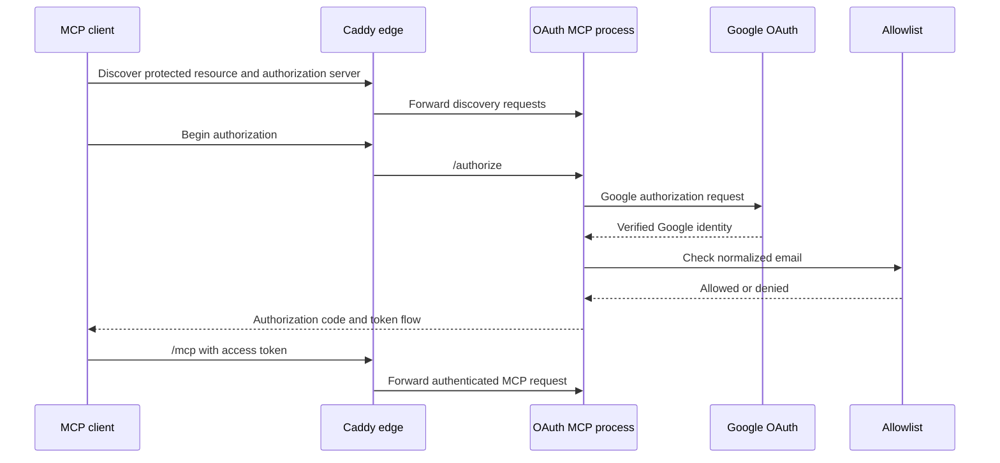

# MCP authentication and edge

## Public contract

The preferred public MCP endpoint is:

```text
https://sanchaya.rasowshi.us/mcp
```

It uses OAuth with Google identity followed by an application allowlist check.
The production Caddy process terminates TLS and forwards the OAuth and MCP
routes to the Patra Darpan OAuth MCP process on the shared private Docker
network.

The source currently retains `/mcp-oauth` as an explicit OAuth alias and
`/mcp-bearer` as a compatibility route. New clients should use `/mcp` and
OAuth.

## OAuth flow



OAuth state is persisted on a host-mounted path so container recreation does
not invalidate all in-progress state. Client credentials and other secrets are
stored only in the private production env file.

## Allowlist

The allowlist is a host-managed UTF-8 text file mounted read-only into the
OAuth container. Each non-empty entry is an email address. A `#` begins a
comment anywhere on a line; the remainder of that line is ignored.

Example:

```text
# Demo users
alice@example.org
bob@example.org  # project collaborator
```

Addresses are normalized before comparison. The process caches the parsed set
and checks file metadata on requests; when the file changes it reloads the
set. Routine additions and removals therefore do not require an image rebuild
or service restart.

Manage the production file outside Git. Validate its mount and OAuth settings
with:

```bash
make oauth-config
```

## Route ownership

The production route source of truth is the Sanchaya-Zoekt
`config/Caddyfile.prod`. Patra Darpan owns the OAuth application and provides a
local Caddy configuration for development.

| Route | Behavior |
| --- | --- |
| `/.well-known/*` | OAuth discovery |
| `/authorize`, `/token`, `/register`, `/revoke`, `/oauth/callback` | OAuth lifecycle |
| `/mcp`, `/mcp/*` | OAuth-protected MCP |
| `/mcp-oauth`, `/mcp-oauth/*` | Explicit OAuth compatibility alias |
| `/mcp-bearer`, `/mcp-bearer/*` | Legacy bearer compatibility route |
| `/api`, `/api/*` | Denied publicly; Zoekt RPC stays private |
| all other paths | Sanchaya-Zoekt web interface and Labs routes |

## Development

The local optional Caddy service exposes the same OAuth route shape at
`https://localhost:8443`. Its certificate is issued by Caddy's local authority,
so native clients must trust that authority. Local certificate handling is only
a development concern; production uses the public certificate for
`sanchaya.rasowshi.us`.

For clients that cannot reach a local endpoint or cannot trust the local
certificate, test OAuth against production after source changes have passed the
local configuration and unit checks.

## Verification boundary

- A `401` from `/mcp` without credentials proves reachability and protection,
  not a completed OAuth session.
- Successful discovery verifies the advertised OAuth endpoints.
- A successful MCP initialization and tool call from the intended client prove
  end-to-end access.
- `make edge-smoke` verifies discovery and route protection but deliberately
  does not automate a user's Google login.
