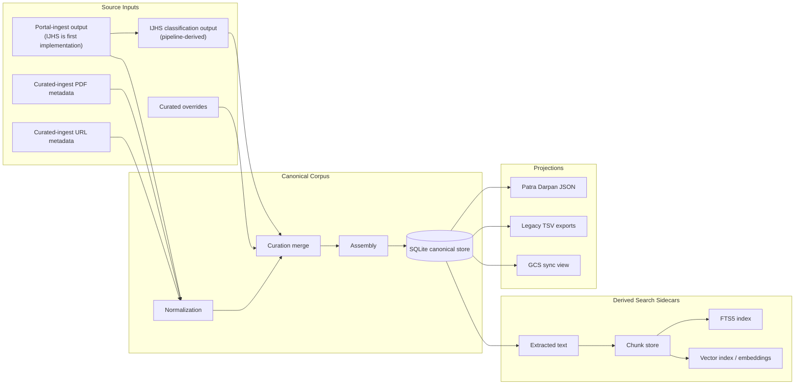
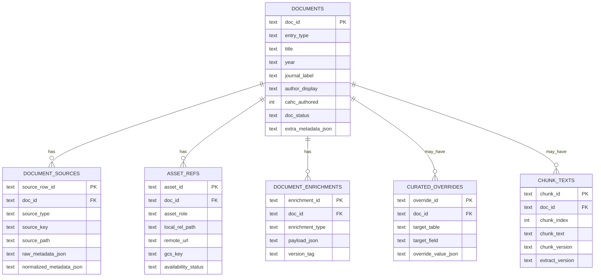
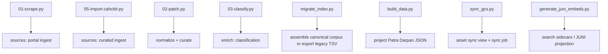

# Spasta Corpus Technical Design

## Status
Draft companion to the PRD in [docs/spasta-corpus-prd.md](docs/spasta-corpus-prd.md).

## Purpose
This document makes the PRD operationally concrete without turning the PRD itself into an implementation scrapbook.

It focuses on:
- canonical schema direction
- sidecar boundaries for text and semantic search
- logical mapping from legacy scripts to the new layer model
- migration sequencing
- concrete decisions that need resolution before implementation hardens

## Design Stance
The system should be opinionated in one place: the canonical corpus.

That means:
- canonical identity, metadata, provenance, and asset references live in the canonical store
- text extraction, chunking, full-text indexing, and vector search live in derived sidecars
- sidecars are rebuildable
- compatibility projections are outputs, not editing surfaces

The immediate goal is not to build the final search stack. The immediate goal is to replicate the current corpus behavior in a structured, auditable form, then add first-class text and similarity search without destabilizing corpus authority.

## Recommended Storage Model
### Canonical Store
Use SQLite as the initial canonical store.

Reasoning:
- low operational footprint
- single-host and worktree-friendly
- good fit for explicit schema authority
- compatible with JSON fields where needed
- compatible with FTS and vector sidecars without introducing PostgreSQL yet

### Search Sidecars
Treat search-oriented structures as sidecars derived from canonical state.

Initial direction:
- full-text search: SQLite `FTS5`
- vector similarity: SQLite `vec1` or a later sidecar implementation if requirements outgrow it
- chunk storage: sidecar tables keyed by canonical IDs

This keeps the main schema stable even if chunking, embedding models, or retrieval strategy change.

## Source-Input Contract
The source-input layer is a set of explicit upstream feeds, not one monolithic store.

Each source input should satisfy this contract:
- it has a named producer
- it has a defined scope
- it is either source-authored, curator-authored, or pipeline-derived
- it is readable without consulting downstream projections
- it may depend on another source input, but that lineage must be explicit
- it is not itself the canonical corpus

The source-input layer is therefore one-to-many:
- one canonical assembly process reads many source inputs
- one document may be informed by many source inputs
- one source input may contribute to many documents

### Source-Input Categories
The categories should be made explicit.

#### 1. Portal-ingest input
Produced by an ingest adapter from a scrapable or machine-ingestable portal source.

Examples:
- IJHS scrape metadata from `pipeline/01-scrape.py`

These are not hand-authored, though they may later be normalized or corrected. IJHS is the first implemented example, not the architectural definition of the category.

#### 2. Curated-ingest input
Produced directly by maintainers for one-off documents, manually entered records, or sources whose automation does not yet exist.

Examples:
- curated PDF metadata from `pipeline/05-import-cahcblr.py` or later curated sources
- curated URL-only entry metadata
- curated overrides

These are hand-authored or curator-controlled feeds.

Current working assumption:
- all non-INSA PDFs are curated-ingest records
- those PDFs currently live under `corpus/other`
- curated PDF metadata may be bootstrapped by Gemini Flash or a similar utility extracting the same bibliographic fields from the PDF itself, likely from the first page or leading pages
- model-assisted review may also propose corrected metadata, but those suggestions are not canonical until accepted into curator-controlled source inputs or explicit overrides

#### 3. Pipeline-derived input
Produced mechanically from another source input, but still treated as an input to canonical assembly rather than as canonical authority itself.

Examples:
- IJHS classification output derived from IJHS scrape metadata via `pipeline/03-classify.py`
- future extracted summaries or document-level derived tags, if assembly chooses to consume them as inputs

These are not hand-authored. They are derived feeds with explicit lineage.

### Important Clarification
`IJHS classification output` is not a peer of portal-ingest metadata in origin.

It should be understood as:
- upstream dependency: portal-ingest metadata
- producer: classification pipeline
- role: enrichment input consumed by assembly
- authority: secondary to canonical assembly, and subordinate to explicit curated overrides where policy says so

### Practical Implication
The source-input layer is not "one file" and not "all hand-authored."

It is a family of feeds such as:
- portal-ingest records
- curated-ingest records
- mechanically derived enrichments

What makes them part of the same layer is not who authored them, but that they are upstream inputs to canonical assembly and are not themselves the final authority.

## High-Level Architecture


## Build And Execution Model
`spasta-corpus` should behave like a dependency-aware build graph, not a fragile one-shot script chain.

### Stage Contract
Each executable stage should declare:
- its inputs
- its outputs
- its invalidation rule
- whether it is full-build only or incrementally rebuildable

For machine-assisted stages, the contract should also declare:
- whether the stage is source capture, derived enrichment, or advisory review
- which outputs are authoritative inputs versus review candidates awaiting acceptance

### Required Properties
- repeatable: unchanged inputs produce unchanged outputs
- idempotent: rerunning a stage does not duplicate rows or drift results
- incremental: a source delta only dirties dependent downstream artifacts
- dependency-aware: unrelated stages do not rerun when their declared inputs have not changed

### Intended Stage Order
1. portal ingest and curated ingest
2. normalization
3. curated overrides application
4. derived enrichments
5. canonical assembly
6. validation
7. projections
8. search sidecar rebuilds

### Example Delta Semantics
- a new portal PDF should dirty the corresponding portal-ingest records and their downstream normalization, enrichment, assembly, projection, and optional extraction/chunk sidecars
- a new curated PDF should not dirty unrelated portal-ingest records
- a changed machine-extracted metadata proposal for a curated PDF should only dirty downstream state after that proposal is accepted into curator-controlled input or override state
- a new URL-only record should flow through ingest, normalization, assembly, validation, and projections, but should not require PDF extraction
- a change to a curated override should dirty only the affected canonical records and dependent projections or sidecars
- a changed local PDF checksum should dirty extraction-, chunk-, embedding-, and search-derived sidecars for the affected `doc_id`
- a link-only metadata change should not dirty PDF-derived sidecars unless the system later supports remote text capture for that link class

### Build-System Implication
The implementation may or may not literally use `make`, but it should have make-like semantics:
- explicit stage boundaries
- explicit dependencies
- safe reruns
- simple delta rebuild

The important requirement is the behavior, not the specific orchestration tool.

### Source Version Format
`source_version` should use one canonical recipe so that invalidation behavior is predictable across stages.

Recommended phase-1 recipe:

```python
import hashlib
from pathlib import Path

def file_version(path: str) -> str:
    data = Path(path).read_bytes()
    return hashlib.sha256(data).hexdigest()[:8]
```

Working rule:
- `source_version` on `document_sources` rows is the fingerprint of the source file bytes at ingest time, not of an individual row
- a changed `source_version` is the signal that downstream normalization, assembly, validation, and projection for affected documents must be reconsidered
- use one shared implementation of this recipe rather than letting each stage invent its own version string format

### Force Rebuild Semantics
The system should support forced rebuild at sensible scopes:
- one `doc_id`
- one source feed or source group
- one canonical selector such as `entry_type=pdf` or another supported field/query filter
- whole corpus

## Canonical Schema
The schema should remain small and legible at phase 1. JSON is allowed as an escape hatch, but should not replace explicit columns for important semantics.

### Table: `documents`
One row per intellectual corpus entry.

Suggested fields:
- `doc_id TEXT PRIMARY KEY`
- `entry_type TEXT NOT NULL`
  Allowed initial values: `pdf`, `link`, `html`
- `title TEXT NOT NULL`
- `subtitle TEXT`
- `year TEXT`
- `journal_label TEXT`
- `author_display TEXT`
- `cahc_authored INTEGER NOT NULL DEFAULT 0`
- `doc_status TEXT NOT NULL DEFAULT 'active'`
  Suggested values: `active`, `hidden`, `merged`, `draft`
- `primary_language TEXT`
- `curation_notes TEXT`
- `extra_metadata_json TEXT`
- `created_at TEXT NOT NULL`
- `updated_at TEXT NOT NULL`

Notes:
- `entry_type` describes the corpus entry at a high level.
- `extra_metadata_json` is allowed for low-frequency or not-yet-promoted metadata.
- If a JSON field becomes important for validation, filtering, projection, or curation, it should graduate into an explicit column.
- Working phase-1 default: `entry_type` is adequate as the top-level discriminator.

### Table: `document_sources`
One row per source record that contributes to a canonical document.

Suggested fields:
- `source_row_id TEXT PRIMARY KEY`
- `doc_id TEXT NOT NULL`
- `source_type TEXT NOT NULL`
  Suggested values: `portal_ingest`, `derived_classification`, `curated_pdf`, `curated_link`, `curated_override`
- `source_key TEXT`
- `source_path TEXT`
- `source_version TEXT`
- `upstream_source_row_id TEXT`
- `raw_metadata_json TEXT`
- `normalized_metadata_json TEXT`
- `ingested_at TEXT NOT NULL`

Notes:
- This table preserves provenance and makes it possible to explain why a document looks the way it does.
- A document may have many source rows.
- Use `source_type`, `source_path`, and `source_version` to capture the contract of each feed explicitly.
- Derived feeds should retain lineage to the upstream feed they came from, using `upstream_source_row_id` or an equivalent explicit reference.
- `source_version` should follow the shared file-fingerprint rule defined above, so invalidation logic does not drift between stages.

### Table: `asset_refs`
One row per access/storage representation associated with a document.

Suggested fields:
- `asset_id TEXT PRIMARY KEY`
- `doc_id TEXT NOT NULL`
- `asset_role TEXT NOT NULL`
  Suggested initial values: `primary_pdf`, `mirror_pdf`, `external_link`
- `local_rel_path TEXT`
- `remote_url TEXT`
- `gcs_key TEXT`
- `mime_type TEXT`
- `file_size_bytes INTEGER`
- `checksum TEXT`
- `availability_status TEXT NOT NULL DEFAULT 'unknown'`
  Suggested values: `present`, `missing`, `remote_only`, `unknown`
- `is_preferred INTEGER NOT NULL DEFAULT 0`
- `asset_metadata_json TEXT`

Notes:
- A document may have zero, one, or many assets.
- Do not infer document identity from `local_rel_path`, `remote_url`, or `gcs_key`.

### Table: `document_enrichments`
One row per enrichment family per document.

Suggested fields:
- `enrichment_id TEXT PRIMARY KEY`
- `doc_id TEXT NOT NULL`
- `enrichment_type TEXT NOT NULL`
  Suggested initial values: `classification`, `summary`, `processing_status`
- `payload_json TEXT NOT NULL`
- `derived_from_source TEXT`
- `derived_at TEXT NOT NULL`
- `version_tag TEXT`

Notes:
- Classification can start here cleanly instead of mutating the core document row for every experiment.
- Stable, high-value enrichment fields can later be promoted into explicit columns or views.

### Table: `curated_overrides`
One row per explicit curator-authored override.

Suggested fields:
- `override_id TEXT PRIMARY KEY`
- `doc_id TEXT`
- `target_table TEXT NOT NULL`
- `target_field TEXT NOT NULL`
- `override_value_json TEXT NOT NULL`
- `reason TEXT`
- `applies_to_source_type TEXT`
- `created_at TEXT NOT NULL`

Notes:
- Keep overrides explicit and auditable.
- This table replaces the silent authority of ad hoc "patching."
- Routine overrides should not silently change `doc_id`; identity merges or rekeys should be handled explicitly by assembly logic or migration scripts.
- `override_value_json` stores the replacement value for `target_field` as a JSON scalar or object, but the apply step must coerce it to the target column's Python/SQL type.
- Recommended convention: store the replacement as a JSON scalar matching the target column type, such as a JSON string for `TEXT` or a JSON integer for `INTEGER`, rather than a wrapped object unless the target itself is structured.

### Table: `document_relations`
Include this in the phase-1 schema so known duplicate and merge cases can be recorded explicitly as they are discovered during migration, even if the table starts sparsely populated.

Suggested fields:
- `relation_id TEXT PRIMARY KEY`
- `left_doc_id TEXT NOT NULL`
- `relation_type TEXT NOT NULL`
  Suggested values: `same_work`, `supersedes`, `merged_into`, `related`
- `right_doc_id TEXT NOT NULL`
- `relation_notes TEXT`

## Search Sidecars
Search sidecars are derived, rebuildable, and secondary to canonical authority.

### Sidecar Principle
- `doc_id` is authoritative in the canonical corpus.
- sidecars reference `doc_id`
- sidecars may define derived IDs such as `chunk_id`, but those are local to the search pipeline

### Table: `chunk_texts`
Suggested sidecar table for extracted text chunks.

Fields:
- `chunk_id TEXT PRIMARY KEY`
- `doc_id TEXT NOT NULL`
- `chunk_index INTEGER NOT NULL`
- `chunk_text TEXT NOT NULL`
- `char_start INTEGER`
- `char_end INTEGER`
- `chunk_version TEXT NOT NULL`
- `extract_version TEXT NOT NULL`
- `chunk_metadata_json TEXT`

Notes:
- Chunking is intentionally not canonical.
- Chunking may change when extraction or splitting improves.

### FTS Sidecar
Suggested model:
- FTS5 virtual table keyed by `chunk_id` and `doc_id`
- index chunk text plus optional document title and author materialized into the sidecar

### Vector Sidecar
Suggested model:
- embeddings keyed by `chunk_id`
- index built for approximate nearest-neighbor retrieval
- exact similarity used only for reranking a small candidate set

Do not design the serving path around full row-scan cosine over all chunks.

## Example Records
The examples below show how canonical identity stays stable while sidecar richness varies.

### Example: `ijhs1`
Canonical:
- `doc_id = 'ijhs1'`
- source rows from portal ingest and derived classification
- preferred asset is a local PDF under the shared corpus root

Sidecars:
- extracted text from PDF
- chunk rows such as `ijhs1:c001`, `ijhs1:c002`
- FTS entries for chunk text
- embeddings for chunk rows

### Example: `manual1`
Canonical:
- `doc_id = 'manual1'`
- source row from curated-ingest PDF metadata
- preferred asset is a local PDF under `corpus/other`

Sidecars:
- extracted text from PDF
- chunk rows
- FTS entries
- embeddings

### Example: `url1`
Canonical:
- `doc_id = 'url1'`
- source row from curated URL-only metadata
- asset is an external link rather than a local PDF

Sidecars:
- may initially have no extracted text
- may still support document-level search over title, author, notes, or curated summary
- may later gain chunks and embeddings if remote text capture is added

## Schema Relationship Diagram


## Legacy Script Mapping
This mapping is logical, not a promise of one-for-one file renaming.

| Legacy script | Current role | New layer role | Likely future home |
|---|---|---|---|
| `pipeline/01-scrape.py` | IJHS scrape and PDF download | portal-ingest adapter | `sources/portal/ijhs_ingest.py` |
| `pipeline/02-patch.py` | metadata fixes in place | split into normalization + curated overrides | `normalize/ijhs_normalize.py`, `curate/apply_overrides.py` |
| `pipeline/03-classify.py` | subject/category enrichment | enrichment | `enrich/classify_subjects.py` |
| `pipeline/04-compare.py` | compare against legacy search outputs | validation / migration audit | `validate/compare_legacy_views.py` |
| `pipeline/05-import-cahcblr.py` | curated import from sibling repo | curated-ingest adapter | `sources/curated/cahc_import.py` |
| `pipeline/bootstrap-ingest.py` | orchestrated ingest utility | orchestration | `jobs/bootstrap_ingest.py` |
| `ops/migrate_index.py` | builds unified index | assembly or legacy projection depending on implementation details | `assemble/build_corpus.py` or `project/legacy_tsv_export.py` |
| `ops/build_data.py` | build web payload | projection | `project/patra_darpan_json.py` |
| `ops/sync_gcs.py` | scan assets and sync to GCS | asset validation / sync projection | `project/gcs_sync_view.py` plus sync job |
| `ops/generate_juni_embeds.py` | search snippets for JUNI | sidecar/search projection | `sidecars/generate_search_sidecars.py` |

## Legacy-To-New Flow Diagram


## JSON Metadata Policy
The canonical corpus should allow bounded JSON fields, but not use them as a dumping ground.

Recommended rule:
- explicit columns for identity, provenance, projection-critical fields, validation-critical fields, and frequently filtered fields
- JSON for source-specific spillover, low-frequency metadata, or experimental fields
- any JSON field that becomes operationally important should be promoted into the schema

This prevents the canonical store from becoming an untyped shadow of today's TSVs.

## Identity Defaults
Working phase-1 default for `doc_id`:
- for portal-ingest IJHS records, mint `doc_id` from `Path(gcs_key).stem`
- for curated PDF records, mint `doc_id` from the local filename stem
- for URL-only records, mint `doc_id` from a short source-prefixed slug derived from the normalized title
- if that candidate collides, append a stable sequence suffix such as `-02`, `-03`, and so on only when the collision is actually observed
- once assigned, treat `doc_id` as stable and canonical rather than continuing to re-derive it from storage properties
- if multiple source rows are later judged to represent the same intellectual work, resolve that through explicit merge/rekey handling rather than casual override edits

This is a workable default, not a claim that the final algorithm is already perfect.

## Canonical Artifact Policy
Working default:
- `spasta-corpus.sqlite` is generated and should not be git-managed by default
- generated JSON and TSV projections should also remain untracked by default
- if generated artifacts are later committed for review or deployment convenience, prefer human-reviewable projections such as JSON or TSV

## Chunk Provenance Policy
Do not expose low-value provenance by default.

The canonical or user-facing model does not need a prominent "chunk came from local vs mirror" attribute unless that distinction is operationally meaningful.

Recommended compromise:
- no user-facing chunk-source concept
- optional low-level extraction provenance in sidecar metadata only when needed for rebuild/debug/invalidation

This keeps the conceptual model small while still allowing operational recovery if extraction inputs change.

## Migration Sequence
### Phase 1: Canonical Replication
- load current source inputs into canonical tables
- reproduce current `index.tsv`-equivalent semantics
- reproduce Patra Darpan projection semantics
- keep search sidecars out of the critical path

Primary migration validation target:
- `corpus/index.tsv` is the main comparison artifact because it is the current unified projection consumed by `ops/build_data.py`
- `corpus/ijhs.tsv` remains useful as an upstream normalization check for portal-ingest behavior, but it is not the primary downstream validation target

### Phase 2: Document-Level Search
- add document-level FTS over title, author, journal, notes, and summaries
- do not require chunking yet

### Phase 3: Text Extraction And Chunk Sidecars
- add extracted text pipeline for PDFs
- materialize chunk sidecar tables
- keep sidecar versioning explicit

### Phase 4: Similarity Search
- add embeddings for chunks
- use ANN candidate generation plus exact reranking
- keep canonical schema unchanged

## Operational Considerations
- configure corpus root explicitly so the feature worktree reads shared binaries from the live repo
- use SQLite in WAL mode when concurrent reads matter
- keep writes short and explicit
- treat sidecars as rebuildable derived state
- keep export generation deterministic so migration diffs are reviewable

## Open Design Questions
- Which fields from current `index.tsv` become first-class columns immediately?
- Which patch behaviors are deterministic normalization versus curator-authored overrides?
- Should classification live only in `document_enrichments` at first, or also be projected into a convenience view?
- Should `generate_juni_embeds.py` be replaced by a generic sidecar build step, or remain a specialized projection for a while?
- At what corpus size does `vec1` cease to be operationally comfortable for the expected retrieval experience?
- Which validations should block projection emission versus emit warnings only?

## Recommendation Summary
- Keep the PRD high-level.
- Use SQLite as the canonical corpus store.
- Treat text, chunks, FTS, and vectors as derived sidecars.
- Preserve the legacy pipeline as migration input, but do not preserve its vocabulary as the new architecture.
- Make `doc_id` authoritative in the canonical corpus and secondary everywhere else.
