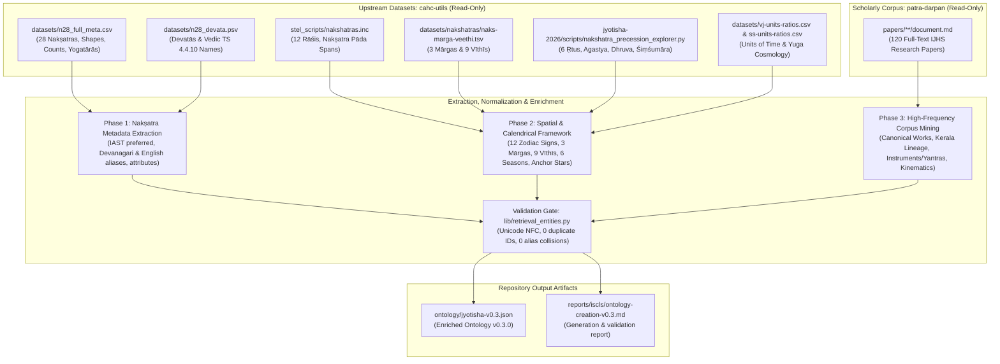

# Jyotisha Ontology Creation & Enrichment Report

**Target Output File**: `ontology/jyotisha-v0.3.json`
**Ontology Schema**: `retrieval.ontology.v1`
**Ontology ID**: `jyotisha`
**Version**: `0.3.0`
**Date**: September 2026

---

## 1. Executive Summary

This document describes the automated, data-driven process used to evolve the initial Jyotisha starter ontology from a minimal stub of 16 entries into an enriched, 143-entity, 632-alias knowledge base.

All source repositories under `~/projects/` were treated as **strictly read-only**. The final ontology snapshot is repository-owned under `ontology/`; this report is retained under `reports/iscls/` and the scratch directory is not a runtime dependency.

### Metric Progression

| Stage | Trigger / Scope | Entities | Aliases | Entity Types Represented |
| :--- | :--- | :--- | :--- | :--- |
| **Initial** | Seed starter ontology | 16 | 57 | `celestial_body`, `jyotisha_concept`, `astronomical_event`, `person` |
| **Stage 1** | 28 Nakṣatra extraction (`cahc-utils`) | 44 | 193 | + `lunar_mansion` (full 28) |
| **Stage 2** | Core astronomical structures (`cahc-utils`) | 90 | 421 | + `zodiac_sign` (12), mārgas, vīthīs, ṛtus, anchor stars |
| **Stage 3** | 120-paper corpus scan (`patra-darpan`) | **143** | **632** | + `instrument` (yantras), canonical works, mathematicians, kinematics, sites |

---

## 2. End-to-End Workflow Diagram



---

## 3. Data Sources and Full Paths

All source paths referenced below are absolute paths on the local filesystem:

### A. Primary Nakṣatra & Astronomical Data (`cahc-utils`)
1. **Nakṣatra Metadata**:
   - `/Users/sunder/projects/cahc/cahc-utils/datasets/n28_full_meta.csv`
   - *Contents*: 28 Nakṣatras with Devanagari names, IAST names, presiding Devatās, Mārga, Vīthī, asterism shapes, Vedāṅga Jyotiṣa star counts (`vgj_cnt`), constituent stars, and Hipparcos proxy star IDs.
2. **Devatā & Vedic References**:
   - `/Users/sunder/projects/cahc/cahc-utils/datasets/n28_devata.psv`
   - *Contents*: Taittirīya Saṃhitā (`kyv4410`) deities and archaic Vedic aliases (*invakā*, *bāhū*, *niṣṭyā*, *vicṛtau*, *śraviṣṭhā*, *śataviṣā*, *proṣṭhapadā*).
3. **Zodiac Signs & Stellarium Coordinates**:
   - `/Users/sunder/projects/cahc/cahc-utils/stel_scripts/nakshatras.inc`
   - *Contents*: The 12 Rāśis (Meṣa to Mīna), Devanagari representations, and nakṣatra pāda boundaries.
4. **Mārgas and Vīthīs**:
   - `/Users/sunder/projects/cahc/cahc-utils/datasets/nakshatras/naks-marga-veethi.tsv`
   - *Contents*: Complete relational mapping of the 3 celestial courses (Uttara, Madhyama, Dakṣiṇa) and 9 celestial lanes (Nāga, Gaja, Airāvatī, Ārṣabhī, Go, Jāradgavī, Mṛga, Ajāvīka, Vaiśvānarī).
5. **Ṛtus and Cosmographic Asterisms**:
   - `/Users/sunder/projects/cahc/cahc-utils/jyotisha-2026/scripts/nakshatra_precession_explorer.py`
   - *Contents*: The 6 seasonal divisions (Vasanta, Grīṣma, Varṣā, Śarat, Hemanta, Śiśira) and celestial anchors (*Agastya*, *Dhruva*, *Śiṃśumāra*, *Matsya*).
6. **Time Units and Calendrical Cycles**:
   - `/Users/sunder/projects/cahc/cahc-utils/datasets/vj-units-ratios.csv`
   - `/Users/sunder/projects/cahc/cahc-utils/datasets/ss-units-ratios.csv`
   - *Contents*: Sub-day units (*muhūrta*, *nāḍikā*, *kalā*, *kāṣṭhā*), Vedic 5-year Yugas, and Sūrya Siddhānta Mahāyuga cycles.

### B. Scholarly Research Literature (`patra-darpan`)
- **Corpus Directory**:
  - `/Users/sunder/projects/sanchaya/patra-darpan/papers/**/document.md`
- *Contents*: 120 digitized, full-text research articles published in the *Indian Journal of History of Science* (IJHS), covering mathematical astronomy, planetary models, instrument engineering, and manuscript analysis.

### C. Validation & Ingestion Engine (`patra-darpan-pdf-semantic-index`)
- **Validation Module**:
  - `/Users/sunder/projects/patra-darpan-pdf-semantic-index/lib/retrieval_entities.py`
- *Validator Function*: `load_alias_targets(ontology_dict)`
- *Role*: Enforces strict compliance with `retrieval.ontology.v1` (NFC Unicode normalization, casefold collision checks, required schema properties `id`, `type`, `preferred_label`, `aliases`).

---

## 4. Architectural Design Pattern (Option C)

The ontology was structured following **Option C** (Root-level source manifest + entity-level references, comments, and structured attributes).

### Root Structure
```json
{
  "schema_version": "retrieval.ontology.v1",
  "ontology_id": "jyotisha",
  "version": "0.2.0",
  "status": "pilot",
  "label": "Jyotisha starter ontology",
  "sources": [
    {
      "id": "cahc_n28_full_meta",
      "path": "cahc-utils/datasets/n28_full_meta.csv",
      "description": "28 Nakshatra metadata: devatas, margas, veethis, asterism shapes, star counts (Vedāṅga Jyotiṣa), and yogatārā identifications"
    },
    {
      "id": "cahc_n28_devata",
      "path": "cahc-utils/datasets/n28_devata.psv",
      "description": "Vedic devatas and alternate Taittirīya Saṃhitā (TS 4.4.10) nakshatra names and notes"
    },
    {
      "id": "patra_darpan_corpus",
      "path": "sanchaya/patra-darpan/papers/**/document.md",
      "description": "Corpus of 120 Indian Journal of History of Science (IJHS) research papers on Indian astronomy, mathematics, and instruments"
    }
  ],
  "entity_types": [
    {"id": "celestial_body", "label": "Celestial body"},
    {"id": "lunar_mansion", "label": "Lunar mansion / nakshatra"},
    {"id": "zodiac_sign", "label": "Zodiac sign / rashi"},
    {"id": "jyotisha_concept", "label": "Jyotisha concept"},
    {"id": "astronomical_event", "label": "Astronomical event"},
    {"id": "instrument", "label": "Astronomical instrument / yantra"},
    {"id": "person", "label": "Person"},
    {"id": "work", "label": "Text or work"},
    {"id": "place", "label": "Place"}
  ],
  ...
}
```

### Entity Design Pattern
Each entity contains:
1. `id`: Unique URI/CURIE slug (e.g. `jyotisha:nakshatra_asvini`, `jyotisha:rasi_mesa`, `jyotisha:work_aryabhatiya`).
2. `type`: Explicit schema entity type.
3. `preferred_label`: Canonical IAST form.
4. `aliases`: Array of multilingual forms (Devanagari, common English transliterations, archaic Vedic forms).
5. `source_ref`: Key pointing back to the root `sources` array.
6. `comment`: Human-readable summary synthesizing devatā, mārga, vīthī, shape, star count, and yogatārā.
7. `attributes`: Structured key-value object containing individual properties for machine readability.

#### Concrete Example: Nakṣatra Entry
```json
{
  "id": "jyotisha:nakshatra_asvini",
  "type": "lunar_mansion",
  "preferred_label": "Aśvinī",
  "aliases": [
    "अश्विनी",
    "Aśvayuk",
    "Ashvini",
    "Ashwini"
  ],
  "source_ref": "cahc_n28_full_meta#N01-Ash",
  "comment": "Devatā: Aśvini | Mārga: Madhyama | Vīthī: Go | Shape: Horseneck | Count: 3 ((α,β,γ) Ari) | Yogatārā: Sheratan (HIP 8903) | Source: cahc_n28_full_meta#N01-Ash",
  "attributes": {
    "nid": "N01-Ash",
    "number_28": 1,
    "daivata": "Aśvini",
    "marga": "Madhyama",
    "veethi": "Go",
    "shape": "Horseneck",
    "star_count": 3,
    "stars": "(α,β,γ) Ari",
    "proxy": "β Ari",
    "yogatara_name": "Sheratan",
    "yogatara_hip": "HIP 8903"
  }
}
```

---

## 5. Current Entity Breakdown (143 Total Entities)

| Category (`entity_type`) | Count | Representative Entities |
| :--- | :--- | :--- |
| `lunar_mansion` | 29 | Concept `nakshatra` + all 28 individual Nakṣatras (*Aśvinī* to *Revatī* + *Abhijit*) |
| `zodiac_sign` | 12 | All 12 Rāśis (*Meṣa*, *Vṛṣabha*, *Mithuna*, *Karka*, *Siṃha*, *Kanyā*, *Tulā*, *Vṛścika*, *Dhanus*, *Makara*, *Kumbha*, *Mīna*) |
| `celestial_body` | 15 | Navagrahas (*Sūrya*, *Candra*, *Maṅgala*, *Budha*, *Bṛhaspati*, *Śukra*, *Śani*, *Rāhu*, *Ketu*), *Agastya* (Canopus), *Dhruva* (Pole Star), *Śiṃśumāra*, *Matsya*, *Saptarṣi*, *Lubdhaka* (Sirius) |
| `jyotisha_concept` | 34 | 3 Mārgas, 9 Vīthīs, 6 Ṛtus, *Lagna*, *Tithi*, *Ahargaṇa*, *Mandaphala*, *Śīghraphala*, *Lambana*, *Nati*, *Valana*, *Dṛkkarma*, *Jyā*, *Kotijyā*, *Utkramajyā*, *Ayanāṃśa*, *Bhagaṇa*, *Vakra*, *Pāta* |
| `astronomical_event` | 2 | *Solar eclipse*, *Lunar eclipse* |
| `instrument` | 7 | *Śaṅku* (Gnomon), *Yantrarāja* (Astrolabe), *Ghaṭikā-yantra* (Clepsydra), *Turīya-yantra* (Quadrant), *Gola-yantra* (Armillary sphere), *Phalaka-yantra*, *Yaṣṭi-yantra* |
| `work` | 18 | *Āryabhaṭīya*, *Sūrya Siddhānta*, *Brahmasphuṭasiddhānta*, *Khaṇḍakhādyaka*, *Siddhānta-Śiromaṇi*, *Vedāṅga Jyotiṣa*, *Vṛddha Gārgīya Jyotiṣa*, *Yuktibhāṣā*, *Tantrasaṅgraha*, *Sadratnamālā*, *Karaṇapaddhati*, *Sūryaprajñapti*, *Candraprajñapti*, *Brahmāṇḍa Purāṇa*, *Pari-pāṭal*, *Karaṇakutūhala*, *Mahābhāskarīya*, *Laghubhāskarīya* |
| `person` | 19 | *Āryabhaṭa*, *Varāhamihira*, *Brahmagupta*, *Bhāskara I*, *Bhāskara II*, *Mādhava of Saṅgamagrāma*, *Nīlakaṇṭha Somayājī*, *Parameśvara*, *Jyeṣṭhadeva*, *Lalla*, *Munīśvara*, *Śrīpati*, *Gaṇeśa Daivajña*, *Kamalākara*, *Sawai Jai Singh II*, *Lagadha*, *Garga*, *K. D. Abhyankar*, *R. N. Iyengar* |
| `place` | 7 | *Ujjayinī*, *Kusumapura* (Pāṭaliputra), *Saṅgamagrāma*, *Vārāṇasī*, *Laṅkā*, *Kurukṣetra*, *Jantar Mantar*, concept `place` |
| **Total** | **143** | **632 Validated Aliases** |

---

## 6. Verification and Validation Log

Validation was executed against `/Users/sunder/projects/patra-darpan-pdf-semantic-index/lib/retrieval_entities.py`:

```python
from lib.retrieval_entities import load_alias_targets
import json

with open("ontology/jyotisha-v0.3.json", "r", encoding="utf-8") as f:
    ont = json.load(f)

targets, stats = load_alias_targets(ont)
# Result: {'casefold': True, 'entity_count': 143, 'alias_count': 632}
```

- **Duplicate Entity IDs**: 0
- **Malformed JSON Syntax**: 0
- **Normalization Standard**: Unicode NFC across all Sanskrit diacritics and Devanagari ligatures.
- **Repository Integrity**: Git working tree in `/Users/sunder/projects/cahc/cahc-utils` remains untouched.

---

## 7. Knowledge Graph Relationships Annotation (v0.3.0)

**Output Artifacts**:
- `ontology/jyotisha-v0.3.json` (active pilot snapshot)
- `ontology/jyotisha-v0.2.json` (pre-graph comparison snapshot)

Version `0.3.0` transitions the ontology from an attributed gazetteer into a queryable **Knowledge Graph** by annotating **147 typed relationships** across **11 populated relation types**. Ten of these types are new graph additions; `described_in` was already part of the v0.1 vocabulary.

### Relation Types Breakdown
1. **`located_in_veethi`** (27 edges): Links 27 source-mapped nakṣatras to their celestial lanes; Abhijit has no Vīthī in the source table.
2. **`subdivision_of_marga`** (9 edges): Links each Vīthī to its parent Mārga.
3. **`associated_with_rasi`** (37 edges): Maps nakṣatra longitudinal spans into Rāśis.
4. **`ruled_by`** (12 edges): Links each Rāśi to its classical planetary ruler.
5. **`authored_by`** (11 edges): Links selected treatises to historical authors.
6. **`composed_at`** (4 edges): Links selected works to composition centers; these remain reviewable historical assertions.
7. **`associated_with_place`** (12 edges): Links people and selected instruments to places.
8. **`described_in`** (15 edges): Links technical concepts to works.
9. **`relates_to_event`** (4 edges): Links eclipse factors to solar and lunar eclipses.
10. **`associated_season`** (12 edges): Maps six Ṛtus to their solar transit Rāśis.
11. **`instrument_used_for`** (4 edges): Links selected yantras to concepts they measure or compute.

Both canonical top-level `"relations"` edge triples and entity-level local `"relations"` cross-links are provided. The top-level array is canonical; local arrays are a rebuildable read projection.
